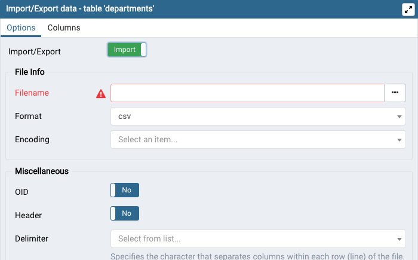

# Employee Database
This project is an example of data analysis and engineering via SQL on Employee data, for future business decisions.


## Getting Started
### Preparation
1) Install pgadmin from [here](https://www.pgadmin.org/download/). And set-up your master password for using PostgreSQL once installed.
### Installing
1) Git clone the repository to your local machine:
    ````
    $ git clone https://github.com/markgat/SQL.git
    ````
## Running
1) Start pgadmin in order to operate PostgreSQL. Once the webpage appears select Servers/PostgreSQL, right click and select Create then Database. Title the database a name of your choice. 
2) Within PostgreSQL, create the tables needed by running the commands in "schemata.sql" by clicking the lightning icon on the top left, copying the commands in "schemata.sql" within the query editor, and then clicking the lighting icon above the editor.
3) Fill the tables with their corresponding CSV data located in
    ````
    /data
    ````
    within the local repository by selecting the Database's Schemata/Tables/ and right-click and choose "Import/Export". From here choose to import, select file in "Filename", "Format" as csv, "Delimiter" as a comma, and then "OK".

4) Execute the queries within "query.sql", one at a time, in the same way as executing the schemata commands to examine data and trends!
